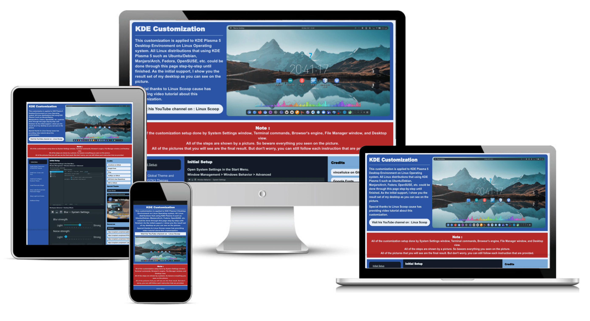

# kde_customization
Customize KDE Plasma 5 Desktop

## Customization included
1. Initial Setup
2. Install Global Theme and GTK2/GTK3 Themes
3. Install Icon, Cursor, and Font
4. Install and Configure Kvantum Theme
5. Install Plasmoids Widget
6. Setup Latte-Dock and Add Plasmoids Widget
7. Setup Login/Lock Screen
8. Additional Setup

## Special Thanks
Linux Scoop

[Linux Scoop on YouTube](https://www.youtube.com/linuxscoop)

[Linux Scoop Website](https://www.linuxscoop.com)

## This Page Built From
1. HTML5 and semantics
2. CSS Flexbox layout
2. jQuery for making tabs
3. JavaScript for making scroll-up button
